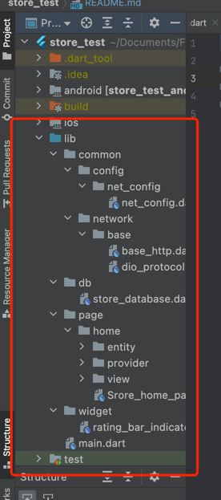

# App_store


```
    flutterSdk:3.0.2
```


```
    flutterSdk:3.0.2
```

#### 安装

```
    git clone https://github.com/insistenceZHUO/app_store_test.git
```

#### 下载依赖包
```
    flutter pub get
```

#### 链接模拟器执行

```
    flutter run
```


#### 项目中用到一些关键库。
- [provider：状态管理框架。](https://pub.flutter-io.cn/packages/provider)
- [dio： 网路请求。](https://pub.flutter-io.cn/packages/dio)
- [sqlife：用于本地数据存储。](https://pub.flutter-io.cn/packages/sqflite)
- [pull_to_refresh：下拉刷新，上拉加载更多。](https://pub.flutter-io.cn/packages/pull_to_refresh)


#### 文件目录介绍



1.  **common**：用于存放项目中公共的模块。
  - **network**：网络请求的封装。
2. **config**：网络请求配置。

3. **db**：数据库模块。store_database.dart 封装了项目中数据库相关操作。
4. **page**：页面
  - **page**下的每一个文件代码一个页面的模块。
  - 如**home**下，包含了一个page页面的入口**Store_home_page.dart**、**provider**、**view**、**entry**。
  - **ProviderStoreHome**：下有一个继承自ChangeNotifier的类。用来存放页面的model。;
  - **StateStoreHome**:存放着页面的状态。在使用provder中做到了页面的view、state、model的分层。
5. **entry**: 序列化数据类。

####  备注
-  在列表中，评分跟评论数没有看到接口上的属性不太确认，项目中列表中评分跟评论数是通过本地随机数生成的。
-  接口中页不确定哪一个参数是作者的参数，所搜索中只是按照应用名称、应用描述来对页面进行搜索。
 

